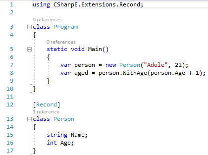
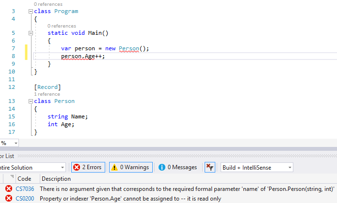
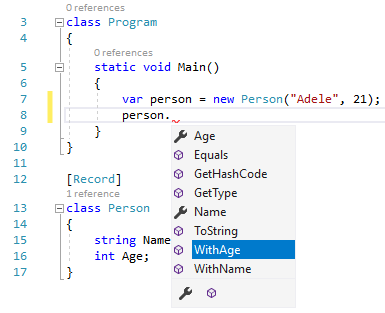
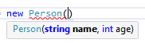
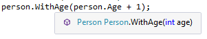

## Links

[Visual Studio extension](https://marketplace.visualstudio.com/items?itemName=svick.CSharpE-Transform-VisualStudio)

[Remote desktop connection](https://github.com/svick/CSharpE/releases/download/20190502/vs2017.rdp)

## VS 2019

> System.TypeLoadException: Method 'IsSymbolAccessibleWithinCore' in type 'CSharpE.Transform.VisualStudio.Compilation' from assembly 'CSharpE.Transform.VisualStudio, Version=1.0.0.0, Culture=neutral, PublicKeyToken=null' does not have an implementation.

## Visual Studio support

Basic features work:

Error reporting works (especially notice that the errors would be different in regular C#):

IntelliSense works (including filter buttons at the bottom):

Parameter info works:

Quick info works when hovering over a member:

